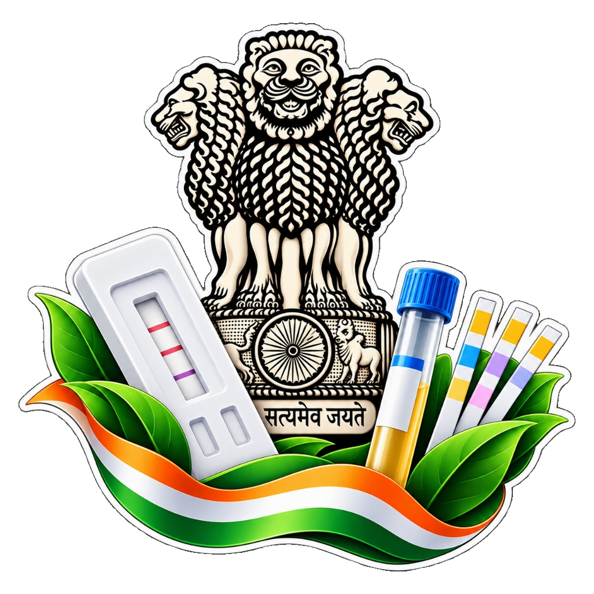

# Unified Drug Testing & Colorimetry System (UDTC)

<div align="center">
  
  <h3>Research-Grade Field Presumptive Drug Testing & Cryptographic Chain of Custody</h3>
  <p><strong>Statutory Compliance:</strong> NDPS Act, 1985 (§52A) &bull; Bharatiya Sakshya Adhiniyam (BSA), 2023 (§63)</p>
  <p>
    
    
    
    
    
  </p>
</div>

---

## 1. Executive Summary

The **Unified Drug Testing & Colorimetry (UDTC)** system is an operational and analytical platform engineered for law enforcement field officers (Narcotics Control Bureau, State Police Anti-Narcotics Units, and Special Task Forces). It modernizes presumptive chemical drug testing by:

1. **Eliminating Human Subjectivity**: Replacing human color perception with standardized, objective colorimetric measurement in CIE $L^*a^*b^*$ color space using CIEDE2000 ($\Delta E^*_{00}$) metrics and Bradford chromatic adaptation.
2. **Automating Statutory Compliance**: Standardizing seizure documentation under **Section 52A of the NDPS Act, 1985** and **Section 63 of the Bharatiya Sakshya Adhiniyam (BSA), 2023**.
3. **Establishing Tamper-Evident Chain of Custody**: Cryptographically sealing evidence on-device with dual asymmetric signatures (hardware-backed Android Keystore ECDSA P-256 + Officer Key), local encrypted hash-chained ledgers, and out-of-band 2G GSM SMS witness anchors for remote, zero-connectivity field operations.

> [!NOTE]
> All chemical reaction classifications generated by this engine are **presumptive screening results**. In accordance with legal statutes, they serve as field probable cause and require definitive confirmatory analysis (GC-MS / HPLC) at an accredited forensic laboratory.

---

## 2. System Architecture

```
+-----------------------------------------------------------------------------------+
|                                 FIELD DRUG SEIZURE                                |
+-----------------------------------------------------------------------------------+
                                          |
                                          v
+-----------------------------------------------------------------------------------+
|                          MOBILE COMPANION (FLUTTER / DART)                         |
|  - Manual Camera Control (Zero Unsolicited Hardware Activation)                   |
|  - Real-Time GNSS Satellite Lock (Latitude / Longitude / Altitude / Accuracy)     |
|  - Forensic NDPS §52A Canvas Watermarking (Burned Metadata & Cryptographic Hash)  |
|  - Kinetic Reaction Countdown Gate (Blocks premature or degraded reads)           |
+-----------------------------------------------------------------------------------+
                                          |
                                          v
+-----------------------------------------------------------------------------------+
|                      COLORIMETRIC COMPUTER VISION ENGINE                          |
|  - Image Quality Pre-Gate: Laplacian Variance Focus & Illuminance Homogeneity     |
|  - Chromatic Adaptation: Bradford Transform (Observer D65 Reference)              |
|  - Standardized Colorimetry: sRGB -> Linear RGB -> CIE 1931 XYZ -> CIE L*a*b*     |
|  - Decision Model: CIEDE2000 (ΔE*₀₀) distance against validated reagent profiles  |
+-----------------------------------------------------------------------------------+
                                          |
                                          v
+-----------------------------------------------------------------------------------+
|                     CRYPTOGRAPHIC ATTESTATION & CHAIN OF CUSTODY                  |
|  - Dual Signature: Hardware Keystore P-256 (Device) + PBKDF2 HMAC-SHA256 (Officer)|
|  - Local Storage: Encrypted SQLite Ledger with SHA-256 Hash-Chaining              |
|  - Out-of-Band Anchor: 140-char GSM SMS Broadcast for Zero-Connectivity Areas     |
|  - Judicial Verification: Section 63 BSA Automated Court Certificate Generation   |
+-----------------------------------------------------------------------------------+
```

---

## 3. Core Modules

| Module | Directory | Description |
| :--- | :--- | :--- |
| **Mobile App** | [`mobile_app/`](mobile_app/) | Production-grade Flutter application with full offline-first workflow, statutory seizure forms, dual-role authentication (Field Officer & Superintendent), and on-demand manual camera. |
| **Colorimetry Engine** | [`engine/`](engine/) | Research-grade analytical Python engine implementing color space conversions, chromatic adaptation, CIEDE2000 calculations, and reaction kinetics. |
| **Security & Forensics** | [`security/`](security/) | Cryptographic signing logic, immutable hash-chain ledger implementation, and Section 63 BSA certificate generator. |
| **Sync Mesh** | [`sync_mesh/`](sync_mesh/) | 2G SMS emergency broadcasting protocol with 140-character GSM compaction for zero-connectivity environments. |
| **Central Depository** | [`backend/`](backend/) | FastAPI central vault for ledger replication, certificate verification, and supervisory audit review. |
| **Card Assets** | [`card_assets/`](card_assets/) | Reference color calibration targets, test fixtures, and synthetic sample generation scripts. |
| **Documentation** | [`docs/`](docs/) | Comprehensive specifications, GIGW 3.0 design guidelines, and master architecture documents. |

---

## 4. Analytical Colorimetry Specification

The colorimetry pipeline strictly adheres to international color science standards:

1. **Chromatic Adaptation**:
   $$\begin{bmatrix} X_{adapted} \\ Y_{adapted} \\ Z_{adapted} \end{bmatrix} = M_{BFD}^{-1} \cdot \text{diag}\left(\frac{\rho_{D65}}{\rho_{src}}, \frac{\gamma_{D65}}{\gamma_{src}}, \frac{\beta_{D65}}{\beta_{src}}\right) \cdot M_{BFD} \cdot \begin{bmatrix} X_{src} \\ Y_{src} \\ Z_{src} \end{bmatrix}$$
2. **CIE $L^*a^*b^*$ Representation**: Decouples lightness ($L^*$) from chromatic opponent channels ($a^*$ green-red, $b^*$ blue-yellow).
3. **CIEDE2000 ($\Delta E^*_{00}$)**: Corrects non-uniformities in earlier $\Delta E^*$ formulas by weighting lightness, chroma, and hue differences with a rotational interaction term ($R_T$).

### Supported Reagent Profiles

| Test Kit Code | Reagent Chemistry | Target Analyte | Reaction Window | Expected Reaction |
| :--- | :--- | :--- | :--- | :--- |
| **NDDK** | Marquis Reagent | Opiates / Heroin / Morphine | 30 – 90 seconds | Violet to Deep Purple |
| **PCDK** | Duquenois-Levine | Cannabinoids / Hashish / Ganja | 45 – 120 seconds | Indigo-Violet / Blue |
| **KDK** | Scott Reagent (Cobalt Thiocyanate) | Cocaine HCl / Crack | 20 – 60 seconds | Cobalt Blue Precipitate |

---

## 5. Security & Legal Evidence Architecture

### Dual-Key Cryptographic Binding
Every seizure record requires two independent factors before appending to the local ledger:
* **Factor 1 (Device Hardware)**: Non-exportable P-256 ECDSA key generated inside the device's hardware-backed Keystore / Trusted Execution Environment (TEE).
* **Factor 2 (Officer Authentication)**: Ephemeral 256-bit key derived in-memory via PBKDF2-HMAC-SHA256 (10,000 iterations) from the officer's secret PIN and unique salt.

### Forensic Watermarking (NDPS §52A)
Every captured image is stamped directly in pixel space with:
* Seizure Record UUID & Timestamp (UTC)
* Officer Badge Number & Hardware Device ID
* GNSS Satellite Coordinates & Accuracy Metric
* Cryptographic SHA-256 checksum of the unwatermarked raw frame

### Out-of-Band 2G SMS Witnessing
For remote operations without cellular data, the system encodes critical seizure evidence into a **140-character GSM-7 payload** sent to the central monitoring gateway:
```text
MHA|2026-DEL-0099|e3b0c44298fc1c149afbf4c8996fb924|MHA-NCB-DEL-042|POS|28.614,77.209
```

---

## 6. Project Directory Layout

```
UDTC/
├── .github/
│   └── workflows/
│       └── build_apk.yml             # GitHub Actions CI/CD automated APK build
├── backend/
│   └── server.py                     # FastAPI central vault & replication service
├── card_assets/
│   ├── generate_card.py              # Reference card generation script
│   └── reference_card_print.png      # MHA calibration card printable asset
├── demo_suite/
│   └── app.py                        # Streamlit verification & demo dashboard
├── docs/
│   ├── DESIGN_SYSTEM_AND_SPECIFICATIONS.md
│   ├── FEATURES_SPECIFICATION.md
│   └── MASTER_PROJECT_PLAN.md
├── engine/
│   └── colorimeter.py                # Research-grade CV colorimetry pipeline
├── mobile_app/                       # Production Flutter Mobile Application
│   ├── android/                      # Native Android keystore & OpenCV plugins
│   ├── assets/                       # Government emblems & test fixtures
│   ├── lib/
│   │   ├── models/                   # OOP domain models
│   │   ├── screens/                  # 8 sequential field seizure screens
│   │   ├── services/                 # Hardware keystore, DB, and forensic engines
│   │   └── theme/                    # GIGW 3.0 Government UI theme
│   ├── test/                         # Full automated unit test suite
│   └── pubspec.yaml                  # Flutter package dependencies
├── security/
│   ├── crypto_signer.py              # Python asymmetric ECDSA P-256 signer
│   ├── hash_ledger.py                # Python hash-chain ledger
│   └── legal_forensics.py            # Section 63 BSA certificate generator
├── sync_mesh/
│   └── sms_anchor.py                 # Out-of-band GSM SMS compaction
├── tests/
│   └── test_full_system.py           # Python integration test suite
├── app_logo.png                      # Application logo
├── requirements.txt                  # Python dependencies
└── README.md                         # Project documentation
```

---

## 7. Getting Started

### Prerequisites
* **Mobile App**: Flutter SDK 3.22+, Android SDK (API Level 28+ recommended), Java 17+
* **Backend & Engine**: Python 3.10+ with `pip`

### Python Setup
```bash
# Create virtual environment
python -m venv venv
source venv/bin/activate  # On Windows: .\venv\Scripts\Activate.ps1

# Install dependencies
pip install -r requirements.txt

# Run Python verification suite
pytest tests/ -v
```

### Mobile App Build
```bash
cd mobile_app

# Fetch dependencies
flutter pub get

# Run all automated tests
flutter test

# Build Release APK
flutter build apk --release --android-skip-build-dependency-validation
```

---

## 8. Automated Testing & Verification

The repository maintains an automated test suite covering all critical operational pathways:

```bash
# Run mobile app tests (Optical processing, quality gate, offline SMS, ledger)
cd mobile_app
flutter test

# Expected Output:
# 00:01 +8: All tests passed!
```

---

## 9. Legal & Regulatory Compliance

* **NDPS Act, 1985 (Section 52A)**: Governs seizure, sampling, and disposal of narcotic drugs. The digital companion automates statutory inventory schedules and panchnama witness logging.
* **Bharatiya Sakshya Adhiniyam, 2023 (Section 63)**: Replaces Section 65B of the Indian Evidence Act for electronic record admissibility. The system generates digitally signed, court-admissible electronic record certificates.
* **GIGW 3.0 Guidelines**: Compliance with official Government of India web and mobile interface design and accessibility standards.

---

## 10. License & Disclaimer

This project is developed for the **Smart India Hackathon (SIH26231)** under the aegis of the Ministry of Home Affairs. 

All testing results produced are **presumptive field classifications** intended solely for law enforcement screening and establishing probable cause. Definitive laboratory confirmation remains legally required.
